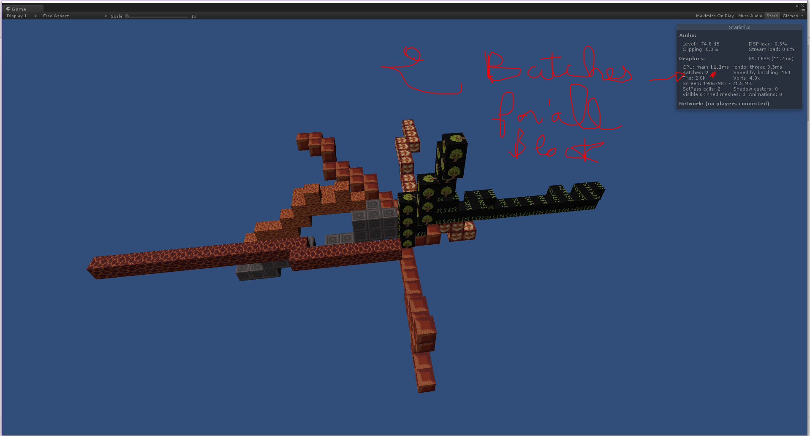

# Unity3d-MineCraft-Blocks-generation

Creating a Minecraft-style block generation system in Unity3D involves generating a world made up of cube-shaped blocks using procedural generation techniques. This allows for vast, dynamic terrains composed of individual blocks that can be manipulated by the player.

Core Concepts of Minecraft-Style Block Generation:
Voxel-Based Terrain:

The world is composed of 3D grid-like structures called voxels.
Each voxel represents a cube (block) in the world, which can be air, dirt, stone, etc.
Chunk System:

The world is divided into manageable sections called chunks (e.g., 16x16x16 blocks).
Generating and rendering the world in chunks improves performance and allows infinite worlds by dynamically loading/unloading chunks as needed.
Procedural Generation:

Use algorithms like Perlin noise or Simplex noise to create realistic terrain heights and biomes.
Each block’s type is determined by the noise value at its position (e.g., grass on top, stone below a certain depth).
Mesh Optimization:

Instead of rendering all blocks individually, create a custom mesh for visible faces only.
Combine adjacent blocks’ faces into a single mesh to reduce the number of draw calls.
Player Interaction:

Implement systems for breaking and placing blocks.
Use raycasting to detect which block the player is targeting.
Data Storage:

Store block data in a 3D array for each chunk (e.g., blocks[x, y, z]).
Serialize or save chunk data to enable persistent worlds.
Lighting:

Implement dynamic or baked lighting to simulate daylight and shadows.
Use block-based light propagation for glowing blocks like torches.
Infinite World Generation:

Use a coordinate-based system to generate and load chunks dynamically as the player moves.
Save unloaded chunks to disk and reload them when needed.

always 1 draw Calls for all blocks !! 

